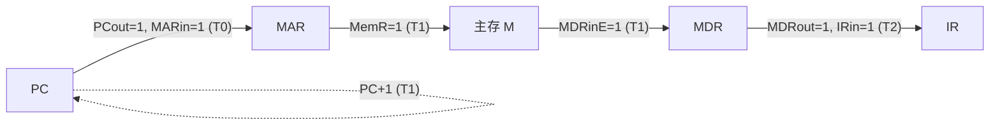
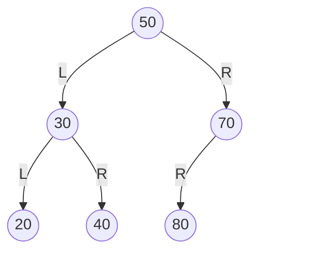
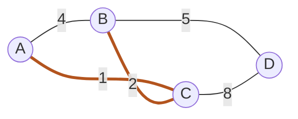
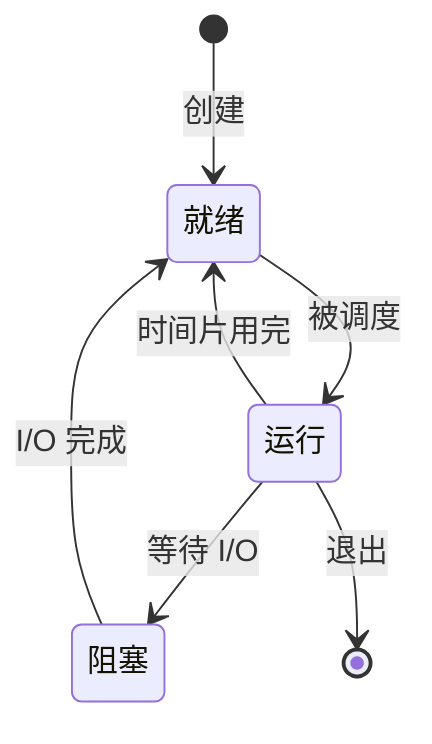
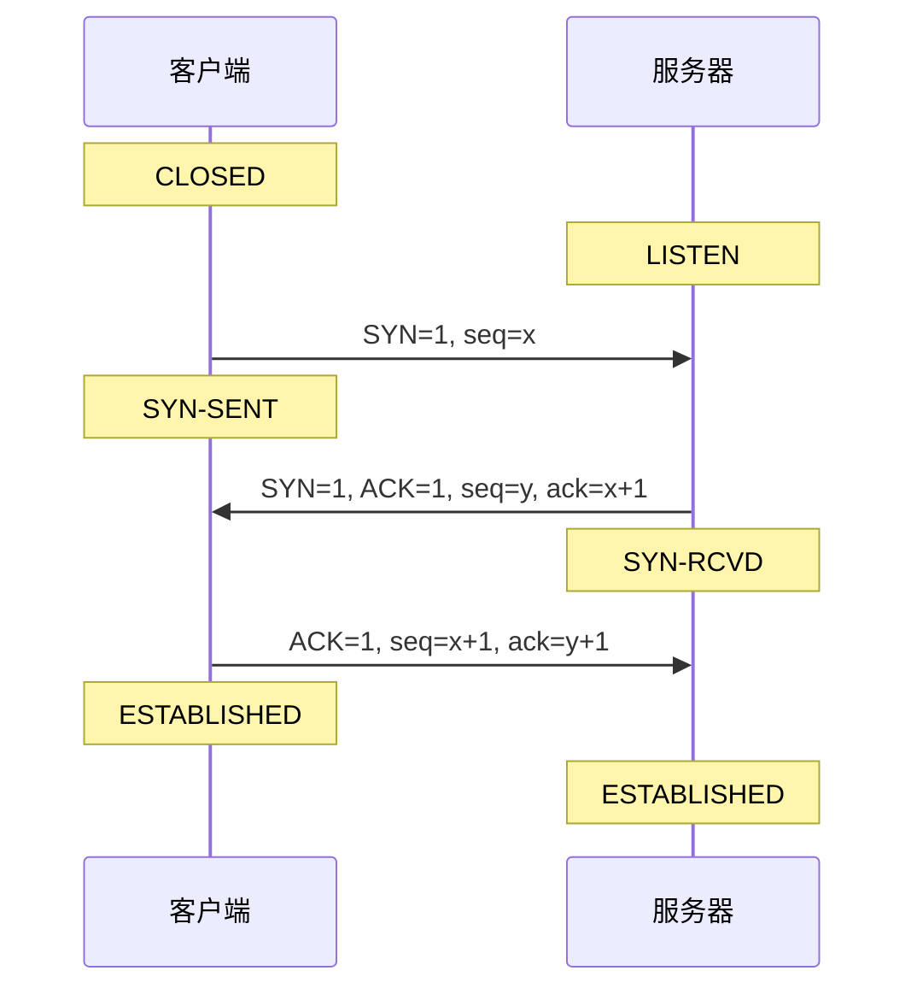
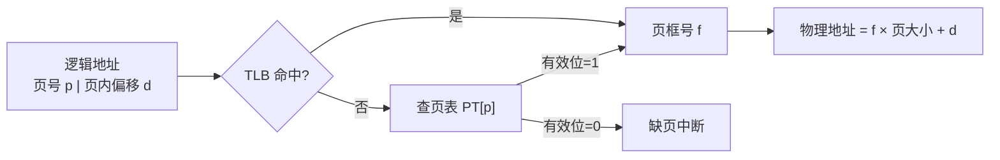
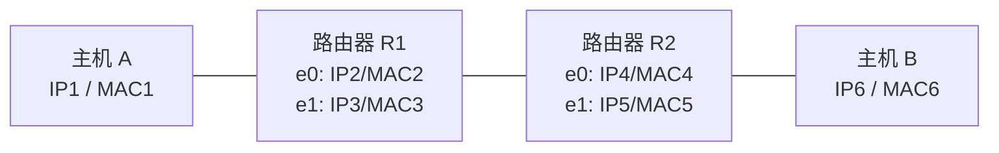

# Mermaid 与表格配图参考（408 结构与时序）

408 的关键信息大多是**结构的、时序的、协议交互的**。这类图没有几何坐标，用 Mermaid 和 Markdown 表格表达比 SVG 稳得多：Obsidian 原生渲染、没有坐标就没有坐标幻觉、纯文本可以直接改。

**选型规则**：

| 用 Mermaid | 用 Markdown 表格 | 用 SVG（见 `svg-figure-guide.md`） |
|---|---|---|
| 树、图、链表这类节点-边结构 | 位段划分（Cache / 浮点 / IP / 指令格式） | 存储器扩展的芯片连线 |
| 进程状态机、TCP 状态机 | 流水线时空网格 | CSMA/CD 时间轴、争用期 |
| 协议时序（握手、挥手、停等、滑动窗口） | 排序每趟快照、KMP next 表 | 磁头移动折线（可选，表格够用时不画） |
| 数据通路的局部流向链 | 节拍与微操作对照 | 其它真几何示意 |
| 地址翻译的查表路径 | 调度甘特表、页面置换逐次表 | |

**判据一句话：有节点和箭头用 Mermaid，是二维矩阵用表格，有真实几何比例才用 SVG。**

---

## 1. 硬性约束（`create_figure.py --kind mermaid` 会校验）

| 约束 | 原因 |
|------|------|
| 第一行必须是图类型（`flowchart LR` / `graph TD` / `sequenceDiagram` / `stateDiagram-v2`） | 没有声明整块不渲染 |
| 节点标签里有 `|` `(` `)` 时必须加引号：`A["PC (out)"]` | 未加引号会被当成语法，整图解析失败 |
| 禁止 `click`、`%%{init}%%`、外链、`<script>` | 静态阅读材料，且 Obsidian 已按主题配色 |
| 括号必须配平 | 最常见的解析失败原因 |
| 源码不带 ```` ``` ```` 围栏 | 围栏由建卡脚本自动加 |
| ≤ 8KB，节点 ≤ 15 个，行数 ≤ 40（超出告警） | 超了说明在画全景，该拆 |

不硬拦但必须遵守：

- **标签里不能写 LaTeX**。`$T_0$` 写成 `T0`，`PC_{out}` 写成 `PCout`。控制信号统一 `PCout=1` 这种纯文本。
- 中文标签可以用，但节点 ID 用英文（`MAR["主存地址寄存器 MAR"]`）。
- 一张图只承载一个认知动作。旋转前后、分裂前后各出一张。

---

## 2. Mermaid 骨架

### 2.1 数据通路的局部流向链（计组最高频）

**严禁画 CPU 全景电路。** 只画本条指令、本个节拍经过的部件，控制信号标在箭头上。



- 每个箭头 = 一个微操作；括号里写发生的节拍，和节拍对照表逐行对得上。
- 走总线的传送经过一个 `BUS["内部总线"]` 节点；单总线结构里同一节拍只能有一对 out/in 信号。
- 执行周期与取指周期分两张图，别叠在一张里。

### 2.2 二叉树、BST、AVL、堆（必须锁定左右）

Mermaid 布局器**不保证子节点左右顺序**，而 BST 和 AVL 旋转的采分点就是左右孩子。必须在边上标 L / R；缺一侧孩子时用不可见占位节点撑位置。



- 旋转、插入、删除这类过程题：画「操作前」「操作后」两张图，caption 写清是哪一步。
- 平衡因子直接写进节点：`A((50 / bf=+2))`。
- 堆用同样的骨架，并在 caption 里补一句数组下标对应关系。

### 2.3 图结构（邻接、遍历、最小生成树）



- 有向图用 `-->`，无向图用 `---`，权值写在边上。
- 遍历题在节点里写访问序号 `A((A ①))`；MST 题用 `linkStyle` 加粗选中的边，`linkStyle` 的编号按边出现顺序从 0 数。

### 2.4 进程状态、TCP 状态（每条边必须有触发事件）



没有触发事件的箭头等于没画。挂起态题再加 `就绪挂起` `阻塞挂起` 两个状态，并把「挂起」「激活」写在边上。

### 2.5 协议时序（握手、挥手、停等、滑动窗口）



- 报文关键字段写在箭头标签里，两端状态变迁用 `Note over`，别塞进箭头。
- 超时重传用 `C--xS: 丢失` 表示丢包，再画一次重传。
- 滑动窗口题在 `Note over C` 里写当前窗口 `[seq 起, seq 止]`。

### 2.6 地址翻译路径（页表、段页式、TLB + Cache）



多级页表按层级串成链：`一级页号 → 一级页表 → 二级页号 → 二级页表 → 页框`。每一步旁边写当前用到的位段。

### 2.7 网络拓扑 + 逐跳转发



拓扑图只放接口地址，转发过程用 3.4 的逐跳封装表。

---

## 3. 表格骨架

表格是 408 里最被低估的图。它天然对齐、可以逐格核对、不会有布局幻觉。**所有表格下方必须有一行校验或合计**，这是表格替代图的代价。

### 3.1 位段划分表（Cache / 浮点 / IP / 指令格式）

| 位序 | 31 … 12 | 11 … 5 | 4 … 0 |
|:---:|:---:|:---:|:---:|
| 字段 | 标记 Tag | 组号 Index | 块内偏移 Offset |
| 位宽 | 20 | 7 | 5 |

位宽校验：`20 + 7 + 5 = 32 ✓`

遇到具体地址必须再补一行二进制切分：

`0x1234ABCD = 0001 0010 0011 0100 1010 1011 1100 1101` → Tag = `0x12345`，Index = `0b1011110` = 94，Offset = `0b01101` = 13

### 3.2 流水线时空表

| 指令 | 1 | 2 | 3 | 4 | 5 | 6 | 7 |
|:---:|:---:|:---:|:---:|:---:|:---:|:---:|:---:|
| I1 | IF | ID | EX | M | WB | | |
| I2 | | IF | ID | **停顿** | EX | M | WB |
| I3 | | | IF | **停顿** | ID | EX | M |

合计：3 条指令 8 个周期；停顿 1 个，原因是 I2 对 I1 的 RAW 数据冒险。

### 3.3 节拍与微操作对照表（计组数据通路大题采分标准）

| 时钟节拍 | 微操作（数据流向） | 有效控制信号（=1） | 通俗解释 |
|:---:|:---|:---|:---|
| T0 | (PC) → MAR | PCout, MARin | 把指令地址送到地址寄存器 |
| T1 | M(MAR) → MDR；(PC)+1 → PC | MemR, MDRinE；PC+1 | 发主存读；计数器自增 |
| T2 | (MDR) → IR | MDRout, IRin | 指令送到指令寄存器 |

校验：每个节拍在单总线上只有一对 out/in；节拍数与 2.1 流向链图的箭头一一对应。

### 3.4 逐跳封装表（跨网段通信）

| 跳步 | 当前设备 | 报文 | 源 IP → 目的 IP | 源 MAC → 目的 MAC | 机制 |
|:---:|:---|:---|:---|:---|:---|
| 1 | 主机 A | IP 分组 | IP1 → IP6 | MAC1 → MAC2 | 目的不在本网段，ARP 查默认网关 |
| 2 | R1 | 同上 | IP1 → IP6 | MAC3 → MAC4 | 查路由表，下一跳 R2 |
| 3 | R2 | 同上 | IP1 → IP6 | MAC5 → MAC6 | 直连网段，ARP 查主机 B |

结论行：IP 端到端不变，MAC 逐跳更换。

### 3.5 拥塞控制 RTT 演进表

| RTT 轮次 | cwnd | ssthresh | 阶段 | 触发事件 |
|:---:|:---:|:---:|:---|:---|
| 1 | 1 | 16 | 慢开始 | |
| 4 | 8 | 16 | 慢开始 | |
| 5 | 16 | 16 | **进入拥塞避免** | cwnd 达到 ssthresh |
| 9 | 20 | 16 | 拥塞避免 | |
| 10 | 1 | **10** | **慢开始** | 超时，ssthresh = 20/2 |

转折点加粗；快重传与超时的处理不同，要在触发事件里写明是哪个。

### 3.6 排序快照表 / KMP next 表

| 趟数 | 数组快照 | 本趟动作 |
|:---:|:---|:---|
| 初始 | 49 38 65 97 76 13 27 | |
| 1 | **38** **49** 65 97 76 13 27 | 38 插入 49 前 |
| 2 | 38 49 **65** 97 76 13 27 | 65 不动 |

| j | 1 | 2 | 3 | 4 | 5 | 6 |
|:---:|:---:|:---:|:---:|:---:|:---:|:---:|
| 模式串 | a | b | a | a | b | c |
| next | 0 | 1 | 1 | 2 | 2 | 3 |

用 1 起始还是 0 起始要和教材一致，并在表上方注明。

### 3.7 调度甘特表 + 周转时间表

| 时间 | 0-3 | 3-5 | 5-9 | 9-11 |
|:---:|:---:|:---:|:---:|:---:|
| 运行 | P1 | P3 | P2 | P4 |

| 进程 | 到达 | 服务 | 完成 | 周转 | 带权周转 |
|:---:|:---:|:---:|:---:|:---:|:---:|
| P1 | 0 | 3 | 3 | 3 | 1.00 |

合计行给平均周转时间与平均带权周转时间。

### 3.8 页面置换逐次表

| 访问序列 | 7 | 0 | 1 | 2 | 0 | 3 |
|:---:|:---:|:---:|:---:|:---:|:---:|:---:|
| 帧 1 | 7 | 7 | 7 | 2 | 2 | 2 |
| 帧 2 | | 0 | 0 | 0 | 0 | 0 |
| 帧 3 | | | 1 | 1 | 1 | 3 |
| 缺页 | ✓ | ✓ | ✓ | ✓ | | ✓ |

合计：缺页 5 次，缺页率 5/6。

### 3.9 磁盘调度轨迹表

| 序号 | 磁道 | 移动距离 |
|:---:|:---:|:---:|
| 起点 | 100 | |
| 1 | 98 | 2 |
| 2 | 183 | 85 |

合计：总寻道 N 道，平均寻道长度 N / 请求数。不用 ASCII 折线，AI 画不齐。

---

## 4. 反例清单

- 画一张带 ALU、总线、全部寄存器的 CPU 全景图 → 引脚一定画错，且没人看得完
- 二叉树不标 L/R → 布局器随手排，BST 的图会说谎
- 标签里写 `$T_0$` → 原样显示美元符号
- 节点标签 `A[PC(out)]` 不加引号 → 整图解析失败（脚本直接拒）
- 一张 sequenceDiagram 画完握手 + 数据传输 + 挥手 → 拆三张
- 位段表不写求和校验 → 少一位没人发现
- 表格里把最终答案（如「答案选 C」）写进去 → `/review` 一打开就泄底。**综合题例外**：节拍表、封装表这类本身就是解题过程的表，允许放在图示区，因为大题复习就是重做过程
- 用 ASCII 画磁头折线、画流水线 → 对不齐，改表格

---

## 5. 落盘流程

Mermaid 走 `create_figure.py`，表格**直接写进解析文本**（`--formal-solution` 或 `--option-analysis`），不走图示区。

```bash
python3 scripts/create_figure.py \
  --question-id qid-xxxxxxxxxxxx \
  --kind mermaid \
  --slug 取指通路 \
  --caption "图1：取指周期 T0 至 T2 的局部数据流向链" <<'MMD'
flowchart LR
  PC["PC"] -->|"PCout=1, MARin=1  (T0)"| MAR["MAR"]
  ...
MMD
```

- 返回的 `figure_arg` 原样传 `--figure`，和 SVG 一样。
- 源码存成 `错题本/_附图/[qid]/[qid]-NN-[slug].mmd`，卡片里内联为 ```` ```mermaid ```` 代码块，前面一行 `%%图源：路径%%` 用来追溯。
- 建卡后在 Obsidian 里确认：图渲染出来了、树的左右和你的解析一致、深色模式下标签可读。
